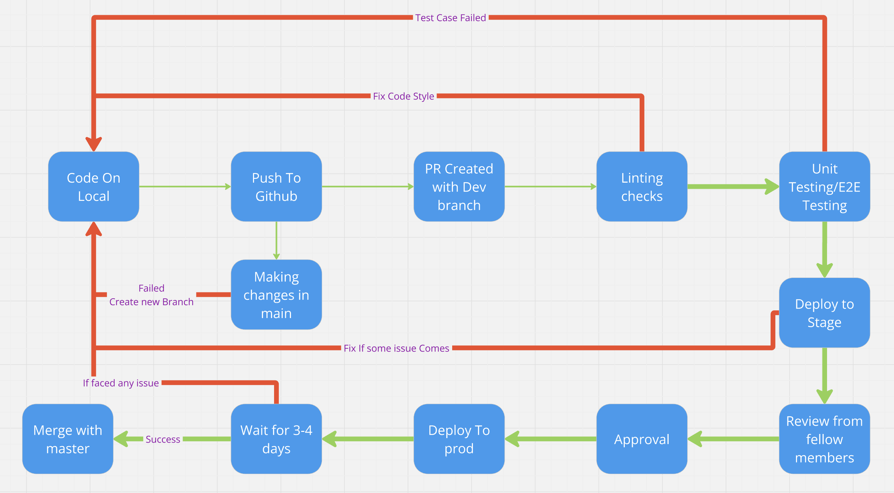

# CI/CD Pipeline

## Currently Functional Pipeline
- **Linting and code style check:**
    We have added a github action for linting so that each code pushed to the repo would first be checked for the linting so that all the code in the repo would follow a single format and it would be easy for another developer to go through our repo. If the action fails then the linting would provide the file where it is failing as well as line and reason for why it is failing so that developer can easily fix that part.

- **Unit test via automation:**
    Our VS Code extension employs @vscode/test-electron as its primary testing framework, enabling comprehensive unit testing of all features. Through this framework, we validate the functionality of each component to ensure proper execution. As part of our continuous integration and deployment (CI/CD) pipeline, all unit test cases must pass successfully before any pull request can be merged into the main branch, maintaining code quality and reliability.

- **Code quality via human review:**
    Every pull request requires approval from at least one team member before merging into the main branch. This peer review process complements our automated testing by ensuring that code changes undergo thorough human oversight. Our reviewers evaluate not only the technical functionality but also assess code quality, maintainability, and adherence to our coding standards, providing an additional layer of quality assurance beyond automated testing.

## Planned to Add in the future
- **Code quality:** 
    We are planning to add a code quality report which would provide the number of test case passed/failed or skipped. This can also provide the code coverage metrics which would help us to look into which all edge cases we have missed.

- **Documentaion generation via automation:**
    For each .js/.ts file this github action would generate a document summarizing what the specific file is doing. So every time a change is there in a file this github action would provide a documentation for all those files where there is a change.
